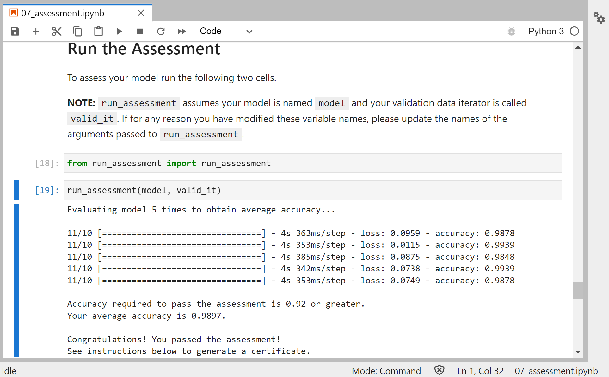

# Recognize Fresh and Rotten Fruits  
  
# Task Objectives  
  
1. Able to distinguish fresh and rotten fruits
2. Validation Accuracy over 92%  
3. Still image classification problem
  

# Evaluation Result (from Jupyter Notebook):

